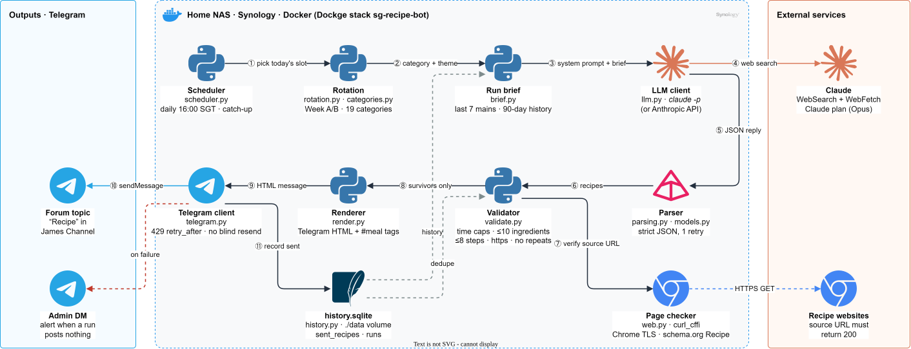
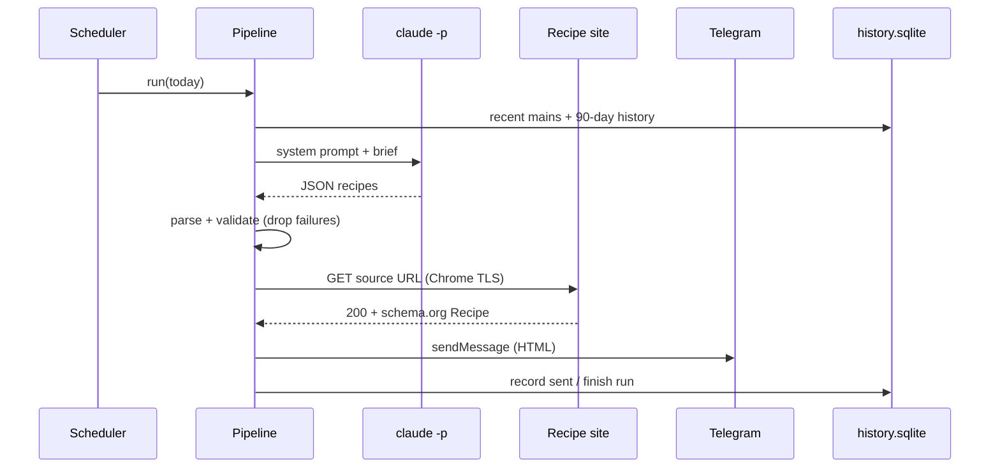

# SG Recipe Bot

A self-hosted daily bot that has Claude find one simple, budget-friendly recipe on the live web, rejects anything that breaks a strict rule set, and posts the survivor to a Telegram forum topic.


-D97757?logo=claude&logoColor=white)




<sub>Editable source: [`docs/architecture.drawio`](docs/architecture.drawio) · PNG fallback: [`docs/architecture.png`](docs/architecture.png)</sub>

## Why this exists

"What should I cook tonight?" is a daily question, and LLMs answer it badly on their own. They
invent recipes, link to pages that don't exist, ignore time budgets and suggest the same chicken
dish three days running. This bot treats the model as an untrusted component. It lets the model
search and write, then checks every answer in code (time caps, ingredient and step limits, a live
`https://` source page, no repeats within the history window). If a recipe fails a check it is
dropped, not patched, so nothing reaches the channel unless it passed.

## Highlights (engineering decisions)

- **The LLM is untrusted input, so there's a validation gate instead of prompt-only rules.** Every
  recipe goes through `recipebot/validate.py`: category match, difficulty, per-category time caps,
  at most 10 counted ingredients (salt, pepper, sugar, oil and water are excluded by regex), at most
  8 steps of 220 characters or fewer, an `https://` URL that isn't a homepage, and no duplicate
  URL or title against history or within the run. A recipe that fails one check is dropped and
  the others still go through.
- **Source links are checked against the live page, not trusted.** `recipebot/web.py` fetches the
  URL with `curl_cffi` Chrome TLS impersonation, because plain `requests` gets 403'd by Cloudflare's
  TLS fingerprinting. It then requires HTTP 200, no redirect to the homepage, and either
  schema.org `Recipe` JSON-LD or ingredient markup. A page behind a bot wall is kept, but logged as
  unverified. That trade-off is documented in the code.
- **Retries are designed to prevent double posts.** `recipebot/telegram.py` retries 429 (honouring
  `retry_after`), 503 and connection failures that happened *before* the request left. A read
  timeout, a TLS error mid-response or a 500/502/504 on `sendMessage` is treated as ambiguous and
  never resent. The recipe is recorded as sent and the admin chat is told, so a network hiccup
  can't post the same recipe twice. The bot token is redacted from every error message and log line.
- **Once-per-day scheduling that survives restarts.** `recipebot/scheduler.py` keys runs by rotation
  date in SQLite. After a NAS reboot it catches up within `RECIPEBOT_CATCH_UP_HOURS` (the window can
  cross midnight). It never repeats a day that already has a run, and if a run died half-way it
  alerts the admin instead of re-running. Every day that is missed anyway (the NAS slept through
  the post time, the container was down past the window) is listed in one admin alert, so no day
  goes silently missing. A brand new database never reports days before the bot existed.
- **The model runs with least privilege and a bounded budget.** The default provider shells out to
  `claude -p` (`recipebot/llm.py` `ClaudeCLIClient`) with `--tools WebSearch,WebFetch`,
  `--strict-mcp-config`, `--no-session-persistence` and a hard timeout. That's one model call a
  day, billed to a Claude plan, with no API key on the NAS. `LLM_PROVIDER=api` swaps in the
  Anthropic SDK (web search tool, `pause_turn` continuation, refusal fallback) behind the same
  `LLMClient` protocol.
- **Structured output with one corrective retry.** The reply is parsed into pydantic models
  (`recipebot/models.py`, `recipebot/parsing.py`). On bad or truncated JSON the parse error is
  appended to the brief and the model gets exactly one more attempt (`MAX_MODEL_ATTEMPTS = 2`).
- **Repeats are prevented in two places.** The brief tells the model about the last 7 main
  ingredients and 90 days of posted titles and URLs (`recipebot/brief.py`), and the validator
  still rejects any URL or title already in `history.sqlite`.

## How it works

The numbers match the diagram.

1. **Pick today's slot.** `scheduler.py` wakes at `RECIPEBOT_POST_TIME` (16:00 SGT) and
   `rotation.py` maps the date to a category and theme (Week A / Week B, 19 categories, optional
   `data/rotation.json` overrides).
2. **Category and theme** go to the brief builder.
3. **Build the brief.** `brief.py` fills `prompts/run_brief.txt` with the category, servings,
   recent mains and history from SQLite. The system prompt is sent verbatim.
4. **Search.** Claude uses WebSearch and WebFetch to find real recipe pages. In `candidates` mode the
   app fetches your own URL lists and passes the schema.org data instead.
5. **Parse** the JSON reply (one retry with the error appended).
6. **Validate** each recipe against the rules above plus history dedupe.
7. **Verify the source URL** over HTTPS with a browser TLS fingerprint.
8. **Render** the survivors as Telegram HTML with estimated calories, macros and S$ cost, plus
   `#breakfast/#lunch/#dinner/#supper` tags.
9. **Hand off** to the Telegram client.
10. **`sendMessage`** to the forum topic (`CHAT/TOPIC` chat id).
11. **Record** the recipe in `history.sqlite`. If nothing could be posted, the admin DM gets a
    short alert.



## Tech stack

| Layer | Tech |
|---|---|
| Language | Python 3.11+ |
| LLM | Claude via `claude -p` (Claude Code CLI), or the Anthropic Python SDK |
| Data validation | pydantic v2 |
| HTTP | `curl_cffi` (Chrome impersonation) for page checks, `requests` for the Telegram Bot API |
| State | SQLite (`sent_recipes`, `runs`) on a bind-mounted volume |
| Delivery | Telegram Bot API, HTML parse mode, forum topics |
| Runtime | Docker Compose on a Synology NAS (Dockge), `restart: unless-stopped`, `init: true`, capped json-file logs |
| Tests | pytest, no network |

## Getting started

**Prerequisites:** Docker with Compose, a Telegram bot from @BotFather added as an admin of your
channel or group, and either a Claude plan (for `claude -p`) or an Anthropic API key.

```bash
cp .env.example .env          # fill in the values below; never commit .env
docker compose build
docker compose run --rm recipebot claude     # one-time: /login, then /exit (stored in ./data/.home)
docker compose run --rm recipebot recipebot check-config
docker compose run --rm recipebot recipebot test-telegram
docker compose run --rm recipebot recipebot run --dry-run   # full run, prints the post, sends nothing
docker compose up -d                                        # daily loop at RECIPEBOT_POST_TIME
docker compose logs -f
```

Minimum `.env` keys (see [`.env.example`](.env.example) for all of them, with comments):

```dotenv
TELEGRAM_BOT_TOKEN=
TELEGRAM_CHAT_ID=            # @channel, numeric id, or CHAT/TOPIC for a forum topic, e.g. -100123.../2765
TELEGRAM_ADMIN_CHAT_ID=      # optional: private chat for failure alerts
LLM_PROVIDER=cli             # cli (claude -p) | api
CLAUDE_CODE_OAUTH_TOKEN=     # optional alternative to /login (from `claude setup-token`)
LLM_API_KEY=                 # only for LLM_PROVIDER=api
TZ=Asia/Singapore
RECIPEBOT_POST_TIME=16:00
```

For a forum topic, the link `t.me/c/2069000031/2765` becomes `TELEGRAM_CHAT_ID=-1002069000031/2765`
(add the `-100` prefix).

**Run locally without Docker:**

```bash
python -m venv .venv && . .venv/bin/activate
pip install -e ".[dev]"
export RECIPEBOT_DATA_DIR=./data
recipebot run --dry-run --category noodles
pytest
```

### Scheduling notes

The container sleeps until the next post time in `TZ`, runs once, then sleeps again. If you'd
rather use the NAS task scheduler, don't start the daemon (if you already did, `docker compose down`;
removing the restart policy doesn't stop a running daemon), and call
`docker compose run --rm recipebot recipebot run` once a day instead. Don't combine the two:
a manual `run` counts as that day's post, so the daemon then skips the day, but a manual `run`
doesn't check whether the daemon already posted, so running it after the post time gives two recipes.

The container only makes outbound HTTPS connections. No port is published.

## Commands

| Command | What it does |
|---|---|
| `recipebot run` | One full run for today. `--category`, `--theme`, `--count 1..3`, `--servings`, `--date YYYY-MM-DD` override the rotation. `--dry-run` posts and records nothing. `--no-page-check` skips fetching source pages. |
| `recipebot loop` | The daemon: runs every day at `RECIPEBOT_POST_TIME`. |
| `recipebot preview FILE.json` | Renders a saved model reply as Telegram HTML. No network. |
| `recipebot rotation [--from DATE] [--days N]` | Prints the upcoming schedule. |
| `recipebot history [--limit N]` | Shows recent posts and runs from the database. |
| `recipebot test-telegram [--admin]` | Sends a hello to the channel or the admin chat. |
| `recipebot check-config` | Prints resolved settings with secrets masked and flags anything missing. |
| `recipebot system-prompt` | Prints the system prompt exactly as it is sent. |

Exit codes: `0` when at least one recipe was posted (or dry-run), `1` otherwise, `2` for a
configuration error.

## Key settings

| Variable | Default | Meaning |
|---|---|---|
| `LLM_MODEL` | `claude-opus-5-5` | Model id (`claude-sonnet-5-5` is roughly half the token price on the API path). |
| `LLM_EFFORT` | `high` | `low` … `max`, or `none`. |
| `LLM_TIMEOUT_SECONDS` | `600` | Hard cap on one model call. |
| `LLM_WEB_SEARCH_MAX_USES` | `10` | Searches per call (API path). |
| `LLM_ALLOWED_DOMAINS` | any | Restricts web search to trusted sites. |
| `RECIPEBOT_SOURCE_MODE` | `search` | `search` (model searches) or `candidates` (your URL lists in `data/candidates/`). |
| `RECIPEBOT_COUNT` | `1` | Recipes per run, 1 to 3. |
| `RECIPEBOT_CATCH_UP_HOURS` | `6` | How long after the post time a missed day can still post, 0 to 23. `0` disables catch-up. |
| `RECIPEBOT_ROTATION_EPOCH` | `2026-09-28` | A date in Week A. |
| `RECIPEBOT_PROMPTS_DIR` | unset | Overrides the packaged `system_prompt.txt` / `run_brief.txt`. |

**Rotation.** Week A: high_protein, chinese_daily, western_daily, asian_daily, baking_cakes,
meal_prep, soups. Week B: quick_20, local_sg, rice_cooker, noodles, desserts_no_oven, seafood,
eggs_tofu_veg. To change it, copy `data/rotation.example.json` to `data/rotation.json`. The file is
re-read on every run, so no restart is needed.

**Adding a category.** Add a block to section 2 of `recipebot/prompts/system_prompt.txt`, a row to
`CATEGORIES` in `recipebot/categories.py`, and the row in `docs/prompt_pack.md`. A test checks that
every category has a prompt block.

## What gets posted

```
🍳 Garlic Soy Chicken with Broccoli
High protein · Chinese inspired · 25 min · easy · serves 2

Ingredients
• 400 g chicken thigh, boneless, cut into bite sized pieces
• ...
Steps
1. Toss the chicken with the cornstarch and a pinch of salt.
2. ...

🔥 About 420 kcal per serving, 40 g protein, 20 g carbs, 20 g fat (estimate)
💰 Ingredients about S$9.50 for 2 servings, S$4.75 each (estimate)
🔗 Full recipe at Example Recipes
#dinner #highprotein #onepan #weeknight
```

Calories, macros and cost are the model's estimates at regular Singapore supermarket prices and
are labelled as estimates. If an estimate is missing or implausible, only that line is dropped;
the recipe still posts.

## Project structure

```
recipebot/
  cli.py           commands (run, loop, preview, rotation, history, ...)
  scheduler.py     daily loop, catch-up, one attempt per date
  pipeline.py      one run end to end
  rotation.py      Week A/B + rotation.json overrides
  categories.py    category table (labels, hashtags, time caps)
  brief.py         fills the run brief from history
  llm.py           ClaudeCLIClient (claude -p) and AnthropicClient
  parsing.py       JSON extraction + top-level contract
  models.py        pydantic models for the reply
  validate.py      the hard checks (drop, never patch)
  web.py           curl_cffi fetcher, bot-wall detection, schema.org extraction
  render.py        Telegram HTML template
  telegram.py      Bot API client (429/5xx retries, no blind resend)
  history.py       SQLite: sent_recipes, runs
  prompts/         system_prompt.txt, run_brief.txt
tests/             pytest suite, no network
docs/              prompt_pack.md (design doc), architecture diagram, Obsidian vault
Dockerfile         bot image with the Claude Code CLI baked in
Dockerfile.claude  optional interactive Claude Code container (compose profile "tools")
```

## Testing & quality

```bash
pip install -e ".[dev]" && pytest
```

The suite has 439 tests across 16 files. They cover validation rules, parsing, rendering,
rotation, the scheduler's catch-up, missed-day and no-double-post logic, the Telegram retry
semantics and the LLM clients. None of them use the network. The last run was 439 passed on Linux;
the SIGTERM test is skipped on Windows. The full design (system prompt, run brief, validation
checks, Telegram template) is in [`docs/prompt_pack.md`](docs/prompt_pack.md).

## Design decisions & limitations

- **Bot-walled pages aren't verified.** A Cloudflare-challenged source page is kept with a warning
  rather than dropped, so a made-up URL on such a site could slip through. The ceiling is marked
  in `validate.py`.
- **Nutrition and cost are estimates** from the model, not a nutrition database or live
  supermarket prices.
- **One run per day, single process.** State is a local SQLite file. That's fine for one NAS
  container, but it isn't built for multiple replicas.
- **Needs an LLM.** There's no offline mode by design: the bot never posts from memory or a fixed
  list.
- **Recipe quality depends on the model.** The validator checks structure and sources, not taste.
- **Roadmap:** have `check-config` flag placeholder values copied from `.env.example`.

---

James Koh · [GitHub](https://github.com/gcjk768)
